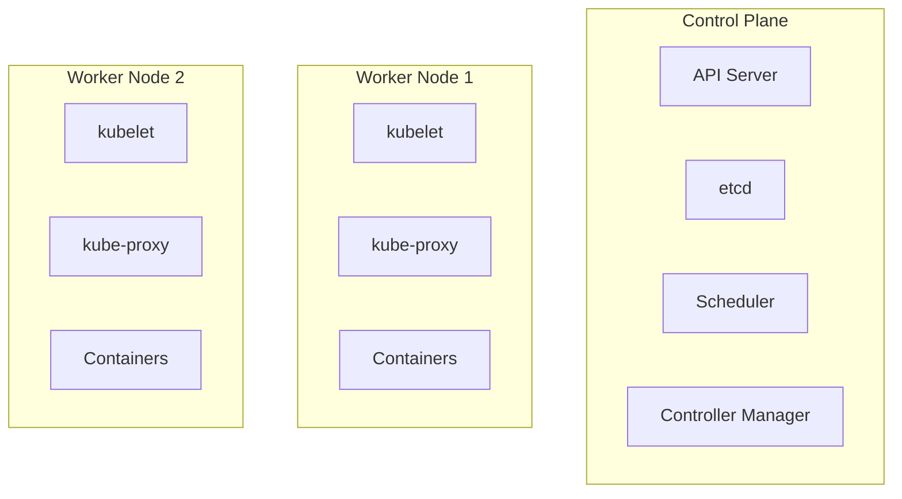

# Part 1: Kubernetes 시작하기 - Container Orchestration의 세계로

Docker로 컨테이너를 만들고 Docker Compose로 여러 컨테이너를 관리해봤다면, 이제 더 큰 규모의 프로덕션 환경을 위한 도구가 필요합니다. 바로 **Kubernetes**입니다. 이번 포스트에서는 Kubernetes의 핵심 개념을 이해하고 첫 애플리케이션을 배포해보겠습니다.

## Container Orchestration이 왜 필요할까?

### 실제 시나리오: 온라인 쇼핑몰의 하루

여러분이 인기 있는 온라인 쇼핑몰을 운영한다고 상상해보세요.

**평상시:**
- 동시 접속자 1,000명
- 서버 3대로 충분히 처리

**블랙프라이데이:**
- 동시 접속자 50,000명! 😱
- 긴급하게 서버 추가 필요

**Docker만 사용할 때의 문제:**
```bash
# 수동으로 각 서버에 접속해서...
ssh server1
docker run -d -p 80:80 shopping-app

ssh server2
docker run -d -p 80:80 shopping-app

# 로드밸런서 설정도 수동으로...
# 모니터링도 직접...
# 장애 발생하면 새벽에 일어나서 복구... 😴
```

**결과:** 
- ⏱️ 서버 추가에 55분 소요
- 💸 트래픽 폭증으로 일부 서비스 다운
- 😫 엔지니어들의 불면의 밤

### Kubernetes가 해결하는 문제들

```yaml
# Kubernetes로는 이렇게 간단히!
apiVersion: apps/v1
kind: HorizontalPodAutoscaler
metadata:
  name: shopping-app-hpa
spec:
  scaleTargetRef:
    apiVersion: apps/v1
    kind: Deployment
    name: shopping-app
  minReplicas: 3
  maxReplicas: 100
  targetCPUUtilizationPercentage: 50
```

**결과:**
- ⚡ 30초 만에 자동 스케일링
- 🛡️ 장애 시 자동 복구
- 😴 엔지니어는 편안한 숙면

## Kubernetes란 무엇인가?

Kubernetes(K8s)는 구글이 15년간의 대규모 서비스 운영 경험을 바탕으로 만든 **컨테이너 오케스트레이션 플랫폼**입니다.

### 핵심 기능

1. **자동 스케일링**: 트래픽에 따라 컨테이너 수 자동 조절
2. **자가 치유**: 장애 발생 시 자동 복구
3. **무중단 배포**: 서비스 중단 없이 업데이트
4. **로드 밸런싱**: 트래픽 자동 분산
5. **서비스 디스커버리**: 서비스 간 자동 연결

### Kubernetes vs Docker Compose

```bash
# Docker Compose - 개발 환경
docker-compose up -d
# 단일 호스트, 수동 관리, 간단한 설정

# Kubernetes - 프로덕션 환경
kubectl apply -f deployment.yaml
# 멀티 호스트, 자동 관리, 강력한 기능
```

## Kubernetes 아키텍처 이해하기

Kubernetes는 마치 잘 조직된 회사와 같습니다.

### Control Plane (경영진)

**1. API Server (대표이사)**
- 모든 요청을 받고 처리
- 클러스터의 중앙 관리 포인트

**2. etcd (기록 보관소)**
- 클러스터의 모든 상태 정보 저장
- 분산 key-value 저장소

**3. Scheduler (인사팀장)**
- 새로운 Pod를 어느 노드에 배치할지 결정
- 리소스 상황을 고려한 최적 배치

**4. Controller Manager (품질관리팀장)**
- 원하는 상태(desired state)와 현재 상태(current state) 비교
- 차이가 있으면 조치를 취함

### Worker Node (현장 직원들)

**1. kubelet (현장 관리자)**
- 각 노드에서 실행되는 에이전트
- 컨테이너가 제대로 실행되는지 감시

**2. kube-proxy (네트워크 담당)**
- 네트워크 규칙 관리
- 서비스로의 연결 담당

**3. Container Runtime (작업 도구)**
- 실제 컨테이너를 실행 (Docker, containerd 등)



## 첫 번째 Kubernetes 애플리케이션 배포하기

### 사전 준비

```bash
# minikube 설치 (로컬 Kubernetes 클러스터)
# macOS
brew install minikube

# Windows (관리자 권한 PowerShell)
choco install minikube

# Linux
curl -LO https://storage.googleapis.com/minikube/releases/latest/minikube-linux-amd64
sudo install minikube-linux-amd64 /usr/local/bin/minikube

# 클러스터 시작
minikube start

# 상태 확인
kubectl cluster-info
```

### 명령형 방식으로 배포하기

먼저 빠르게 배포해보는 명령형 방식부터 시작하겠습니다.

```bash
# 1. Deployment 생성 (애플리케이션 실행)
kubectl create deployment first-app --image=nginx:latest

# 2. 배포 상태 확인
kubectl get deployments
# NAME        READY   UP-TO-DATE   AVAILABLE   AGE
# first-app   1/1     1            1           30s

# 3. Pod 확인 (실제 실행 중인 컨테이너)
kubectl get pods
# NAME                         READY   STATUS    RESTARTS   AGE
# first-app-6b7b9f5b9d-x7n4m   1/1     Running   0          45s

# 4. Service 생성 (외부 노출)
kubectl expose deployment first-app --port=80 --type=LoadBalancer

# 5. Service 확인
kubectl get services
# NAME         TYPE           CLUSTER-IP      EXTERNAL-IP   PORT(S)        AGE
# first-app    LoadBalancer   10.96.232.123   <pending>     80:31234/TCP   10s
```

### minikube에서 서비스 접속하기

```bash
# minikube는 실제 LoadBalancer가 없으므로 터널링 사용
minikube service first-app

# 또는 포트 포워딩
kubectl port-forward service/first-app 8080:80
# 이제 http://localhost:8080 으로 접속 가능!
```

## 선언형 방식으로 배포하기

실무에서는 YAML 파일을 사용한 선언형 방식을 선호합니다.

### deployment.yaml 작성

```yaml
apiVersion: apps/v1
kind: Deployment
metadata:
  name: nginx-deployment
  labels:
    app: nginx
spec:
  replicas: 3  # 3개의 복제본 실행
  selector:
    matchLabels:
      app: nginx
  template:
    metadata:
      labels:
        app: nginx
    spec:
      containers:
      - name: nginx
        image: nginx:1.21
        ports:
        - containerPort: 80
        resources:
          requests:
            memory: "64Mi"
            cpu: "250m"
          limits:
            memory: "128Mi"
            cpu: "500m"
```

### service.yaml 작성

```yaml
apiVersion: v1
kind: Service
metadata:
  name: nginx-service
spec:
  selector:
    app: nginx
  type: LoadBalancer
  ports:
    - protocol: TCP
      port: 80
      targetPort: 80
```

### 배포 및 관리

```bash
# 배포
kubectl apply -f deployment.yaml
kubectl apply -f service.yaml

# 또는 한 번에
kubectl apply -f .

# 상태 모니터링
kubectl get all
kubectl describe deployment nginx-deployment
kubectl logs -l app=nginx

# 스케일링
kubectl scale deployment nginx-deployment --replicas=5

# 업데이트 (이미지 변경)
kubectl set image deployment/nginx-deployment nginx=nginx:1.22

# 롤백
kubectl rollout undo deployment/nginx-deployment
```

## kubectl 필수 명령어 마스터하기

### 리소스 조회

```bash
# 기본 조회
kubectl get pods
kubectl get deployments
kubectl get services
kubectl get nodes

# 자세한 정보
kubectl get pods -o wide
kubectl get pods -o yaml

# 레이블로 필터링
kubectl get pods -l app=nginx

# 모든 네임스페이스
kubectl get pods --all-namespaces
```

### 리소스 상세 정보

```bash
# describe: 이벤트와 상세 정보
kubectl describe pod <pod-name>
kubectl describe deployment <deployment-name>

# logs: 컨테이너 로그
kubectl logs <pod-name>
kubectl logs <pod-name> -f  # 실시간 로그
kubectl logs <pod-name> --previous  # 이전 컨테이너 로그
```

### 리소스 생성/수정/삭제

```bash
# 생성
kubectl create -f <file.yaml>
kubectl apply -f <file.yaml>  # 생성 또는 업데이트

# 수정
kubectl edit deployment <name>
kubectl patch deployment <name> -p '{"spec":{"replicas":5}}'

# 삭제
kubectl delete -f <file.yaml>
kubectl delete deployment <name>
kubectl delete pod <name> --force --grace-period=0  # 강제 삭제
```

### 디버깅 명령어

```bash
# Pod 내부 접속
kubectl exec -it <pod-name> -- /bin/bash

# 포트 포워딩
kubectl port-forward pod/<pod-name> 8080:80

# 리소스 사용량
kubectl top nodes
kubectl top pods

# 이벤트 확인
kubectl get events --sort-by=.metadata.creationTimestamp
```

## 실전 예제: 웹 애플리케이션 배포

### 1. Node.js 애플리케이션 준비

```javascript
// app.js
const express = require('express');
const app = express();
const port = 3000;

app.get('/', (req, res) => {
  res.json({
    message: 'Hello Kubernetes!',
    hostname: process.env.HOSTNAME,
    version: '1.0.0'
  });
});

app.get('/health', (req, res) => {
  res.status(200).send('OK');
});

app.listen(port, () => {
  console.log(`App listening at http://localhost:${port}`);
});
```

```dockerfile
# Dockerfile
FROM node:16-alpine
WORKDIR /app
COPY package*.json ./
RUN npm ci --only=production
COPY . .
EXPOSE 3000
CMD ["node", "app.js"]
```

### 2. Kubernetes 매니페스트 작성

```yaml
# k8s-app.yaml
---
apiVersion: apps/v1
kind: Deployment
metadata:
  name: node-app
  labels:
    app: node-app
spec:
  replicas: 3
  selector:
    matchLabels:
      app: node-app
  template:
    metadata:
      labels:
        app: node-app
    spec:
      containers:
      - name: node-app
        image: your-dockerhub-username/node-app:1.0.0
        ports:
        - containerPort: 3000
        env:
        - name: NODE_ENV
          value: "production"
        resources:
          requests:
            memory: "128Mi"
            cpu: "100m"
          limits:
            memory: "256Mi"
            cpu: "200m"
        livenessProbe:
          httpGet:
            path: /health
            port: 3000
          initialDelaySeconds: 30
          periodSeconds: 10
        readinessProbe:
          httpGet:
            path: /health
            port: 3000
          initialDelaySeconds: 5
          periodSeconds: 5
---
apiVersion: v1
kind: Service
metadata:
  name: node-app-service
spec:
  selector:
    app: node-app
  type: LoadBalancer
  ports:
    - protocol: TCP
      port: 80
      targetPort: 3000
```

### 3. 배포 및 테스트

```bash
# Docker 이미지 빌드 및 푸시
docker build -t your-dockerhub-username/node-app:1.0.0 .
docker push your-dockerhub-username/node-app:1.0.0

# Kubernetes 배포
kubectl apply -f k8s-app.yaml

# 배포 확인
kubectl get all -l app=node-app

# 로그 확인
kubectl logs -l app=node-app

# 서비스 테스트
kubectl port-forward service/node-app-service 8080:80
curl http://localhost:8080
```

## 트러블슈팅 가이드

### Pod가 Running 상태가 되지 않을 때

```bash
# 1. Pod 상태 확인
kubectl get pods
kubectl describe pod <pod-name>

# 2. 일반적인 문제들
# - ImagePullBackOff: 이미지를 가져올 수 없음
#   → 이미지 이름/태그 확인, 레지스트리 인증 확인
# - CrashLoopBackOff: 컨테이너가 계속 재시작
#   → 로그 확인: kubectl logs <pod-name>
# - Pending: 스케줄링 되지 않음
#   → 리소스 부족, 노드 셀렉터 확인
```

### 서비스에 접근할 수 없을 때

```bash
# 1. Service와 Endpoints 확인
kubectl get svc
kubectl get endpoints

# 2. 레이블 셀렉터 매칭 확인
kubectl get pods --show-labels
kubectl describe svc <service-name>

# 3. 네트워크 정책 확인
kubectl get networkpolicies
```

## 모범 사례

### 1. 리소스 제한 설정
항상 requests와 limits를 설정하여 리소스 사용을 제어하세요.

```yaml
resources:
  requests:
    memory: "128Mi"
    cpu: "100m"
  limits:
    memory: "256Mi"
    cpu: "200m"
```

### 2. Health Check 구현
liveness와 readiness probe를 구현하여 자가 치유 기능을 활용하세요.

```yaml
livenessProbe:
  httpGet:
    path: /health
    port: 8080
  initialDelaySeconds: 30
  periodSeconds: 10

readinessProbe:
  httpGet:
    path: /ready
    port: 8080
  initialDelaySeconds: 5
  periodSeconds: 5
```

### 3. 레이블 전략
일관된 레이블 전략으로 리소스를 체계적으로 관리하세요.

```yaml
labels:
  app: myapp
  version: v1.0.0
  environment: production
  team: backend
```

## 다음 단계

축하합니다! 이제 Kubernetes의 기본을 마스터했습니다. 다음 포스트에서는 더 깊이 있는 주제들을 다룰 예정입니다:

- ReplicaSet과 고가용성
- 다양한 Service 타입 활용
- ConfigMap과 Secret 관리
- 영구 저장소와 Volume
- 자동 스케일링 (HPA)

Kubernetes는 강력하지만 복잡한 도구입니다. 하지만 기초를 탄탄히 다지면 점진적으로 고급 기능들도 익힐 수 있습니다. 계속해서 실습하고 실험해보세요!

---

**시리즈 네비게이션**
- ← 이전: [Kubernetes 완벽 가이드: 시리즈 소개](/posts/kubernetes-series-overview)
- → 다음: [Part 2: Kubernetes 핵심 개념 마스터하기](/posts/kubernetes-core-concepts)