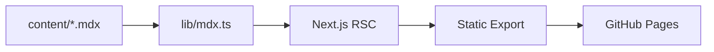

## 개요

기술 학습 노트와 프로젝트 회고를 한 곳에 모으기 위해 만든 개인 블로그입니다.
정적 사이트 생성으로 호스팅 비용을 0원으로 유지하면서, MDX의 컴포넌트 임베딩 기능을 활용해
다이어그램·코드 하이라이팅·인터랙티브 예제까지 한 글 안에서 표현할 수 있도록 했습니다.

## 주요 기능

- MDX 기반 글쓰기 (Mermaid 다이어그램, 코드 하이라이팅, TOC 자동 생성)
- 카테고리/태그 필터링 + 한글 슬러그 지원
- 다크 모드, 시리즈 글, 관련 글 추천
- Giscus 댓글, Google Analytics 4, OpenGraph 자동 생성

## 아키텍처

## 회고

처음 만들 때는 SSR을 고려했지만, 글 빌드 시점이 정해져 있는 블로그 특성상
정적 export가 운영 부담과 비용 모두에서 훨씬 유리했습니다. App Router의
서버 컴포넌트 + MDX RSC 조합으로 클라이언트 번들도 작게 유지할 수 있었습니다.
